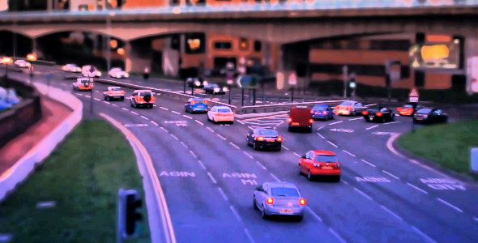

# GPU-Histogram-Equalization

An efficient histogram equalizer on GPU with C++/CUDA.
The parallel implementation allows the program to handle big PNG files.

#### Before equalization :

#### After equalization :

## Requirements

* g++
* nvcc

## Usage

* Compilation : `make`
* Run : `./histogram_equalizer inputImageName outputName`
    * *inputImageName* : image to process, must be a PNG file
    * *outputName* : name of the output without extension
* Delete binaries : `make clean`
